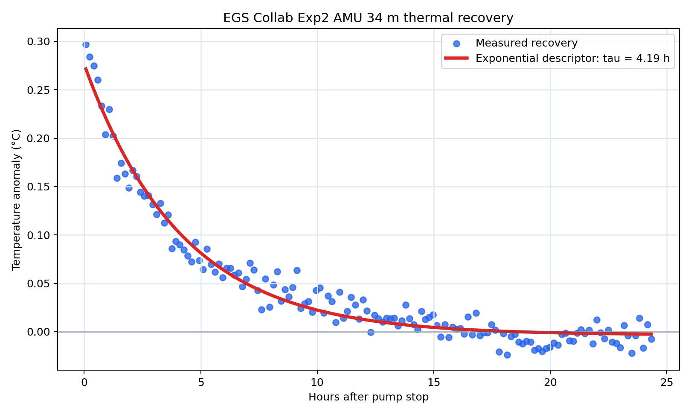
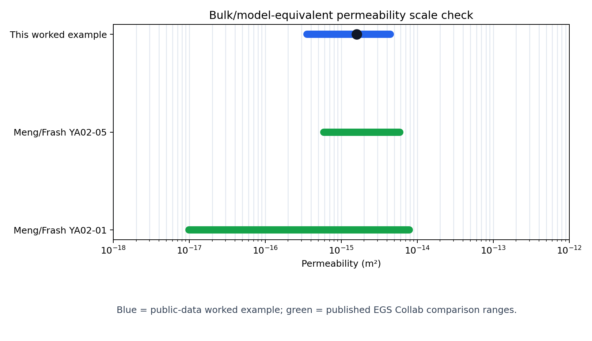

# Geothermal recovery screening

This repository supports a public-data screening framework for testing a
Purwamaska and Fulton 2026-style idea: borehole temperature-recovery records can
sometimes be converted into bulk/model-equivalent permeability estimates in
`m²`, but only when the forcing, timing, geometry, and claim boundary are
source-backed.

The starting point is the method, not this repository. The Purwamaska and Fulton 2026 paper
shows that thermal recovery can carry permeability information when the timing,
pressure/flow forcing, thermal forcing, geometry, and observation location are
made explicit. For readers new to that paper, `docs/method_basis_purwamaska_fulton.md`
gives a plain-language summary and links to the 2026 article and supporting
model archive. This repo asks a narrower public-data question: can that same
style of reasoning be demonstrated across a small, honest set of public
temperature-recovery routes?

The active demonstration applies an evidence ladder to six
threshold-compatible public thermal-recovery routes and one below-threshold
control. This is intentionally a handful-of-public-datasets demonstration, not a
large database paper or a claim of exhaustive geothermal coverage. The scientific
claim is the screening logic: decide which public records can support
model-equivalent permeability, and label which records remain discovery-only,
figure-only, source-request-needed, metadata-limited, or support-only.

An included EGS Collab Experiment 2 AMU 34 m case is the current reproducible
worked example. It rebuilds one thermal-recovery descriptor, one
pressure/flow/geometry-based permeability scale, and static comparison figures
from included processed inputs so the evidence ladder can be inspected end to
end.

## What this repo is for

The project is closest in spirit to method papers that establish credibility
across a handful of public benchmark datasets rather than through exhaustive
surveying. The current count sits in that range: six threshold-compatible
thermal-recovery routes plus one below-threshold control, compared with adjacent
public-dataset method papers that use 3, 4, 5, 7, or 22 public datasets or
record groups. See `docs/public_dataset_method_analogs.md` for the comparison
frame.

For each route, the screening ladder asks whether the public evidence includes:

1. processed temperature, pressure, and flow rows from public-source-derived
   inputs;
2. a fitted recovery descriptor, such as `tau`, for the temperature curve;
3. a declared boundary calculation, `k_eq = mu * Q * L / (A * deltaP)`;
4. a bulk/model-equivalent permeability band in `m²`;
5. a nearby published permeability-scale comparison when validation is claimed.

The EGS Collab worked example gives one checked result within that broader
screen. It is a scale check, not a direct rock measurement: preferred
`1.59e-15 m²`, with a source-constrained band of
`3.52e-16–4.40e-15 m²`.

## Included worked-example figures

The first figure shows the measured EGS Collab temperature recovery and the
simple fitted recovery descriptor. The second figure shows the resulting
bulk/model-equivalent `m²` scale check against nearby published EGS Collab
permeability ranges.





## Reproduce

```bash
python -m venv .venv
source .venv/bin/activate
pip install -r requirements.txt
python scripts/reproduce_egs_collab_exp2.py
python scripts/check_reproduction.py
```

Expected regenerated outputs:

- `artifacts/egs_collab_exp2_amu34m_recovery_fit.png` — measured recovery curve
  and exponential descriptor fit.
- `artifacts/egs_collab_exp2_amu34m_k_scale_check.png` — model-equivalent
  `m²` band compared with nearby published EGS Collab ranges.
- `artifacts/egs_collab_exp2_summary.json` — machine-readable fitted values,
  forcing values, and claim boundary.

Expected checked values:

- `tau_h ≈ 4.19`
- `rmse_c ≈ 0.0125`
- `flow_l_min = 0.400`
- `delta_p_mpa = 22.7`
- `k_eq_preferred_m2 ≈ 1.59e-15`
- `k_eq_band_m2 ≈ 3.52e-16–4.40e-15`

## Readable demo

- `notebooks/egs_collab_exp2_worked_example.ipynb` walks through the same case
  as a reviewer-facing notebook.
- The scripts remain the canonical reproduction path; the notebook is a readable
  companion for inspecting the calculation.

## Evidence boundary

Allowed statements:

> This repository demonstrates a public-data evidence ladder for deciding when
> geothermal temperature-recovery records can support claim-bounded
> bulk/model-equivalent permeability estimates.

> The EGS Collab Exp2 AMU 34 m worked example gives a public-data
> bulk/model-equivalent permeability scale check that is numerically consistent
> with nearby published EGS Collab permeability ranges.

Not claimed:

- measured rock permeability;
- exact-fracture permeability;
- exact same-sample validation;
- geometry-independent permeability;
- field-scale forecasting;
- a permeability result for unresolved candidate datasets.

Candidate and blocked routes are listed in `docs/dataset_catalog.md`; the status
terms are defined in plain language in `docs/evidence_labels.md`. A blocked or
source-request route is not counted as a permeability result here. The method
basis comes from Purwamaska and Fulton 2026-style thermal recovery. The current
public repo includes one fully reproducible worked example plus a screening
catalog; it is not a universal method validation.

## Repository contents

- `data/processed/` — small processed inputs for the EGS Collab worked example.
- `data/provenance/` — source URLs and processing notes for the processed inputs.
- `params/` — case parameters and expected values.
- `scripts/reproduce_egs_collab_exp2.py` — rebuilds figures and summary JSON.
- `scripts/check_reproduction.py` — verifies expected numeric values and outputs.
- `notebooks/egs_collab_exp2_worked_example.ipynb` — readable walkthrough of the
  worked example.
- `artifacts/` — regenerated static figures and summary JSON.
- `docs/method_basis_purwamaska_fulton.md` — plain-language summary of the 2026 method paper behind this repo.
- `docs/egs_collab_exp2_worked_example.md` — method and interpretation for the
  worked example.
- `docs/dataset_catalog.md` — compact status catalog for screened routes.
- `docs/evidence_labels.md` — status labels used for source-backed claims.
- `docs/public_dataset_method_analogs.md` — why a handful of public datasets is
  a reasonable method-demonstration scale.
- `docs/release_readiness_checklist.md` — checklist for a future versioned release or DOI decision.
- `docs/sources.md` — public sources used by this repository.

## Data policy

This repository intentionally excludes raw HDF5 files, ZIP exports, NetCDF
files, private notes, candidate-funnel files, and unpublished source rows. The
included CSVs are small processed snippets for reproducing the worked example;
they are not substitutes for the upstream public datasets or papers.

## Citation and reuse

If this repository is useful, cite it as preliminary research software using
`CITATION.cff`. Code reuse is covered by `LICENSE`.

Text, figures, processed snippets, and upstream-source reuse caveats are
explained in `NOTICE.md`. The included CSVs are small reproducibility snippets,
not a new raw-data archive and not a blanket reuse license for the original EGS
Collab datasets, papers, or reports. Check the upstream sources in
`docs/sources.md` and `data/provenance/egs_collab_exp2_sources.yml` before
reusing source-derived materials.
