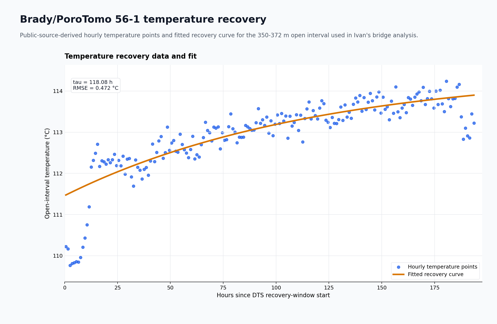
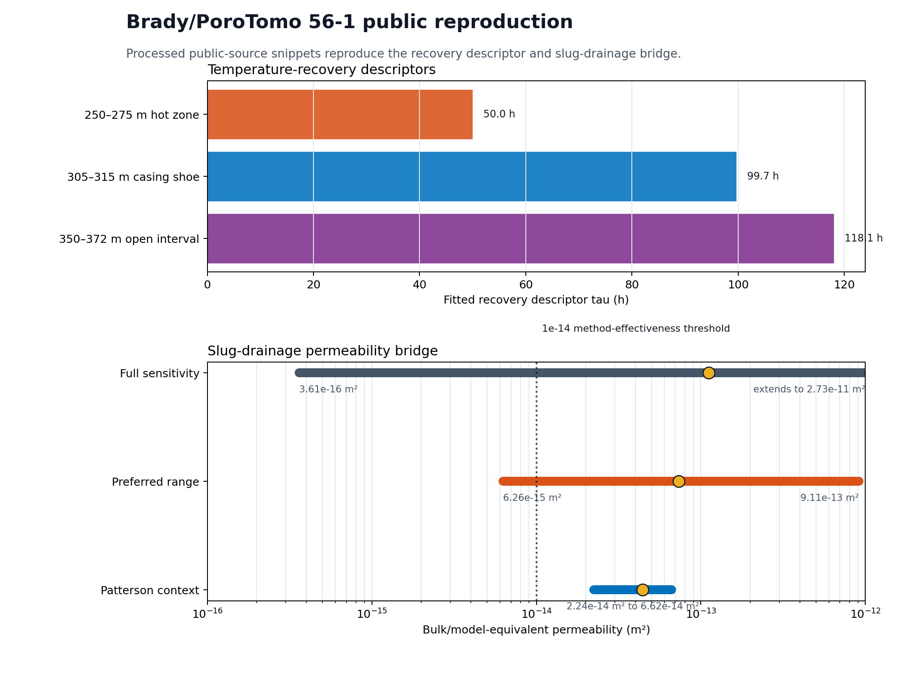

# Geothermal recovery screening

This repository supports a public-data screening framework for testing a
Purwamaska and Fulton 2026-style idea: borehole temperature-recovery records can
sometimes be converted into bulk/model-equivalent permeability estimates in
`m²`, but only when the forcing, timing, geometry, and claim boundary are
source-backed.

The starting point is the method, not this repository. The Purwamaska and Fulton 2026 paper
shows that thermal recovery can carry permeability information when the timing,
pressure/flow forcing, thermal forcing, geometry, and observation location are
made explicit. For readers new to that paper, `docs/method_basis_purwamaska_fulton.md`
gives a plain-language summary and links to the 2026 article and supporting
model archive. This repo asks a narrower public-data question: can that same
style of reasoning be demonstrated across a small, honest set of public
temperature-recovery routes?

The active demonstration applies an evidence ladder to six
threshold-compatible public thermal-recovery routes and one below-threshold
control. This is intentionally a handful-of-public-datasets demonstration, not a
large database paper or a claim of exhaustive geothermal coverage. The scientific
claim is the screening logic: decide which public records can support
model-equivalent permeability, and label which records remain discovery-only,
figure-only, source-request-needed, metadata-limited, or support-only.

The featured verified example is now Brady/PoroTomo 56-1 cold-slug DTS. It gives
a qualified threshold-compatible result, with central `7.35e-14 m²` and
preferred range `6.26e-15–9.11e-13 m²`, compared against independent
same-field/fault-scale permeability context. EGS Collab remains in the
repository only as a below-threshold control, not the headline proof case.

## What this repo is for

The project is closest in spirit to method papers that establish credibility
across a handful of public benchmark datasets rather than through exhaustive
surveying. The current count sits in that range: six threshold-compatible
thermal-recovery routes plus one below-threshold control. The point is to make
the evidence ladder inspectable, not to imply exhaustive coverage.

For each route, the screening ladder asks whether the public evidence includes:

1. processed temperature, pressure, and flow rows from public-source-derived
   inputs;
2. a fitted recovery descriptor, such as `tau`, for the temperature curve;
3. a declared boundary calculation, `k_eq = mu * Q * L / (A * deltaP)`;
4. a bulk/model-equivalent permeability band in `m²`;
5. a nearby published permeability-scale comparison when validation is claimed.

The Brady/PoroTomo 56-1 route gives the current checked threshold-compatible
example within that broader screen. It is a qualified scale comparison, not a
direct rock measurement or exact outflow-patch validation: central
`7.35e-14 m²`, preferred range `6.26e-15–9.11e-13 m²`.

## Included verified-example figures

The first figure shows the Brady/PoroTomo cold-slug DTS alignment and selected
recovery window. The second figure shows the slug-drainage bridge and comparison
against independent same-field/fault-scale permeability context.





## Reproduce

```bash
python -m venv .venv
source .venv/bin/activate
pip install -r requirements.txt
python scripts/reproduce_brady_porotomo_56_1.py
python scripts/reproduce_egs_collab_exp2.py
python scripts/check_reproduction.py
```

Expected regenerated Brady/PoroTomo outputs cover the public-safe processed
recovery descriptors, slug-drainage permeability bridge, and summary JSON. The
DTS alignment image remains a reviewed source-evidence artifact because this
repository does not redistribute raw DTS, pressure, or flow rows.

Checked Brady/PoroTomo values:

- `tau_h ≈ 118.08`
- `rmse_c ≈ 0.472`
- `k_eq_central_m2 ≈ 7.35e-14`
- `k_eq_preferred_range_m2 ≈ 6.26e-15–9.11e-13`
- independent comparison context mostly `2.24e-14–6.62e-14 m²`

## Readable demo

- `docs/brady_porotomo_56_1_worked_example.md` describes the featured verified
  case and its claim boundary.
- `notebooks/egs_collab_exp2_worked_example.ipynb` remains a readable below-threshold-control walkthrough.
- `scripts/reproduce_brady_porotomo_56_1.py` rebuilds the Brady processed
  descriptor/slug-bridge summary and bridge figure from public-safe snippets.
- `scripts/reproduce_egs_collab_exp2.py` remains the canonical reproduction
  path for the retained EGS Collab below-threshold control.

## Evidence boundary

Allowed statements:

> This repository demonstrates a public-data evidence ladder for deciding when
> geothermal temperature-recovery records can support claim-bounded
> bulk/model-equivalent permeability estimates.

> The Brady/PoroTomo 56-1 cold-slug DTS example gives a qualified
> threshold-compatible public-data route with same-field/fault-scale support,
> while preserving the geometry and comparator-scale caveats.

Not claimed:

- measured rock permeability;
- exact-fracture permeability;
- exact same-sample validation;
- geometry-independent permeability;
- field-scale forecasting;
- a permeability result for unresolved candidate datasets.

Candidate and blocked routes are listed in `docs/dataset_catalog.md`; the status
terms are defined in plain language in `docs/evidence_labels.md`. A blocked or
source-request route is not counted as a permeability result here. The method
basis comes from Purwamaska and Fulton 2026-style thermal recovery. The current
public repo includes one featured verified example, one reproducible
below-threshold control, and a screening catalog; it is not a universal method
validation.

## Repository contents

- `data/processed/` — small processed inputs for Brady/PoroTomo and the retained EGS Collab below-threshold control.
- `data/provenance/` — source URLs and processing notes for the processed inputs.
- `params/` — case parameters and expected values.
- `scripts/reproduce_brady_porotomo_56_1.py` — rebuilds the Brady slug-bridge figure and summary JSON.
- `scripts/reproduce_egs_collab_exp2.py` — rebuilds EGS Collab control figures and summary JSON.
- `scripts/check_reproduction.py` — verifies expected numeric values and outputs.
- `notebooks/egs_collab_exp2_worked_example.ipynb` — readable walkthrough of the
  worked example.
- `artifacts/` — regenerated static figures and summary JSON.
- `docs/method_basis_purwamaska_fulton.md` — plain-language summary of the 2026 method paper behind this repo.
- `docs/brady_porotomo_56_1_worked_example.md` — featured verified/qualified
  threshold-compatible example.
- `docs/egs_collab_exp2_worked_example.md` — method and interpretation for the retained below-threshold control.
- `docs/dataset_catalog.md` — compact status catalog for screened routes.
- `docs/evidence_labels.md` — status labels used for source-backed claims.
- `docs/release_readiness_checklist.md` — checklist for a future versioned release or DOI decision.
- `docs/sources.md` — public sources used by this repository.

## Data policy

This repository intentionally excludes raw HDF5 files, ZIP exports, NetCDF
files, private notes, candidate-funnel files, and unpublished source rows. The
included CSVs are small processed snippets for reproducing the worked examples;
they are not substitutes for the upstream public datasets or papers.

## Citation and reuse

If this repository is useful, cite it as preliminary research software using
`CITATION.cff`. Code reuse is covered by `LICENSE`.

Text, figures, processed snippets, and upstream-source reuse caveats are
explained in `NOTICE.md`. The included CSVs are small reproducibility snippets,
not a new raw-data archive and not a blanket reuse license for the original
datasets, papers, or reports. Check the upstream sources in `docs/sources.md`
and `data/provenance/` before reusing source-derived materials.
